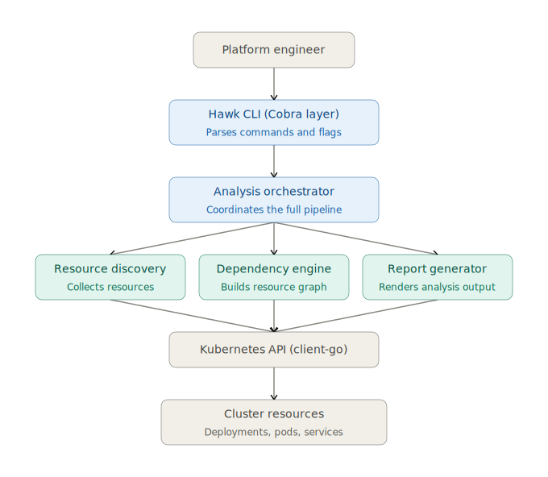

  

# Hawk

> **Understand Kubernetes dependencies before production changes.**

Hawk is a **dependency analysis engine** packaged as a native `kubectl` plugin that discovers relationships between Kubernetes resources and evaluates the operational impact of modifying or deleting a workload.

Instead of manually tracing Deployments, ReplicaSets, Pods, Services, ConfigMaps, Secrets, PersistentVolumeClaims, and Ingresses, Hawk constructs a unified dependency graph and presents the workload's blast radius in a single report.

Designed for **Platform Engineers**, **DevOps Engineers**, **Site Reliability Engineers (SREs)**, and Kubernetes operators.

  <!-- Demo GIF -->

  <strong>Fast • Read-only • Zero Cluster Footprint • Krew Compatible</strong>

## Why Hawk?

Kubernetes exposes infrastructure as individual API objects.

Operators, however, think in terms of **applications**.

A single production workload often spans multiple Kubernetes resources:

- Deployments
- ReplicaSets
- Pods
- Services
- ConfigMaps
- Secrets
- PersistentVolumeClaims
- Ingresses

While `kubectl` allows you to inspect these resources individually, it does not explain **how they relate to one another** or what the operational impact of changing a workload might be.

Hawk bridges that gap by automatically discovering ownership relationships, building a dependency graph, and presenting the complete blast radius of a workload before changes are made.

  

## The Problem

Modern Kubernetes applications are composed of interconnected resources distributed across multiple API groups.

A Deployment may own ReplicaSets and Pods, expose traffic through Services and Ingresses, consume ConfigMaps and Secrets, and depend on PersistentVolumeClaims for storage.

Although Kubernetes stores these relationships internally, operators must manually correlate them using multiple `kubectl` commands before making production changes.

As clusters scale, manual dependency analysis becomes increasingly difficult, introducing unnecessary operational risk during deployments, upgrades, migrations, and incident response.

Before deleting or modifying a workload, engineers need clear answers to questions such as:

- Which Pods belong to this Deployment?
- Which Services expose these Pods?
- Is the workload externally accessible through an Ingress?
- Which ConfigMaps and Secrets are consumed?
- Does it rely on persistent storage?
- What is the overall operational blast radius?

Answering these questions manually is slow, repetitive, and error-prone.

---
## The Solution

Hawk performs dependency-aware analysis directly against the Kubernetes API using the official `client-go` library.

Starting from a target workload, Hawk recursively traverses Kubernetes ownership relationships, discovers dependent resources, and constructs an internal dependency graph representing the application's topology.

The graph is then evaluated by the Blast Radius Engine, which identifies operational dependencies such as exposed services, persistent storage, configuration resources, and sensitive secrets.

The final result is rendered as a structured terminal report that provides engineers with an immediate understanding of the workload's dependencies and potential operational impact.

  

## Core Capabilities

Hawk provides a dependency-centric view of Kubernetes workloads through a native `kubectl` experience.

Key capabilities include:

- Automatic dependency discovery across supported Kubernetes resources
- Ownership traversal using Kubernetes `OwnerReferences`
- Dependency graph construction for workload analysis
- Blast radius evaluation for operational impact assessment
- Detection of Services, Ingresses, ConfigMaps, Secrets, and PersistentVolumeClaims
- Read-only analysis with zero modifications to cluster state
- Native `kubectl` plugin integration
- Cross-platform binaries with Krew support
