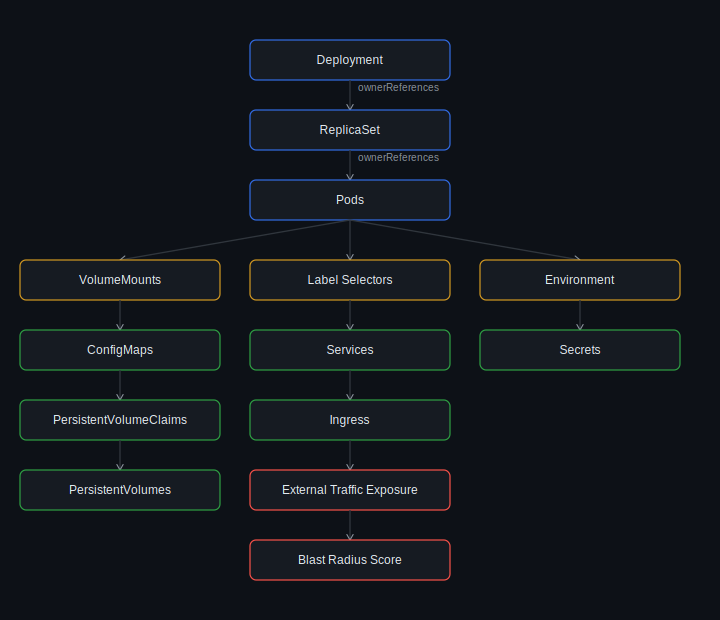
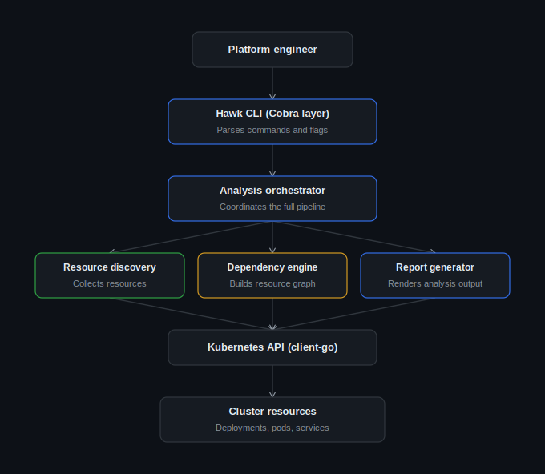

<p align="center">
  
</p>

<div align="center">

#  Hawk

**Understand Kubernetes dependencies before production changes.**


</div>

Hawk is a **dependency analysis engine** packaged as a native `kubectl` plugin that discovers relationships between Kubernetes resources and evaluates the operational impact of modifying or deleting a workload.

Instead of manually tracing Deployments, ReplicaSets, Pods, Services, ConfigMaps, Secrets, PersistentVolumeClaims, and Ingresses, Hawk constructs a unified dependency graph and presents the workload's blast radius in a single report.

Built for **Platform Engineers**, **DevOps Engineers**, **SREs**, and Kubernetes operators.

<div align="center">

**Fast  • Krew Compatible**

</div>

## Table of Contents

- [Why Hawk?](#why-hawk)
- [The Problem](#the-problem)
- [The Solution](#the-solution)
- [Core Capabilities](#core-capabilities)
- [Installation](#installation)
- [Quick Start](#quick-start)
- [Features](#features)
- [Supported Resources](#supported-resources)
- [Why not plain `kubectl`?](#why-not-plain-kubectl)
- [Design Goals](#design-goals)
- [Performance](#performance)
- [Documentation](#documentation)
- [Contributing](#contributing)
- [License](#license)

---

## Why Hawk?

Kubernetes exposes infrastructure as individual API objects. Operators, however, think in terms of **applications**.

A single production workload often spans multiple Kubernetes resources — Deployments, ReplicaSets, Pods, Services, ConfigMaps, Secrets, PersistentVolumeClaims, and Ingresses.

`kubectl` lets you inspect these resources individually, but it doesn't explain **how they relate to one another**, or what the operational impact of changing a workload might be.

Hawk bridges that gap by automatically discovering ownership relationships, building a dependency graph, and presenting the complete blast radius of a workload before changes are made.

<p align="center">
  
</p>

## The Problem

Modern Kubernetes applications are composed of interconnected resources distributed across multiple API groups. A Deployment may own ReplicaSets and Pods, expose traffic through Services and Ingresses, consume ConfigMaps and Secrets, and depend on PersistentVolumeClaims for storage.

Kubernetes stores these relationships internally, but operators must manually correlate them using multiple `kubectl` commands before making production changes. As clusters scale, manual dependency analysis becomes increasingly difficult, introducing unnecessary operational risk during deployments, upgrades, migrations, and incident response.

Before deleting or modifying a workload, engineers need clear answers to questions such as:

- Which Pods belong to this Deployment?
- Which Services expose these Pods?
- Is the workload externally accessible through an Ingress?
- Which ConfigMaps and Secrets are consumed?
- Does it rely on persistent storage?
- What is the overall operational blast radius?

Answering these manually is slow, repetitive, and error-prone.

## The Solution

Hawk performs dependency-aware analysis directly against the Kubernetes API using the official `client-go` library.

Starting from a target workload, Hawk recursively traverses Kubernetes ownership relationships, discovers dependent resources, and constructs an internal dependency graph representing the application's topology.

The graph is then evaluated by the Blast Radius Engine, which identifies operational dependencies such as exposed Services, persistent storage, configuration resources, and sensitive Secrets.

The result is rendered as a structured terminal report that gives engineers an immediate understanding of a workload's dependencies and potential operational impact.

<p align="center">
  
</p>

## Core Capabilities

- Automatic dependency discovery across supported Kubernetes resources
- Ownership traversal using Kubernetes `OwnerReferences`
- Dependency graph construction for workload analysis
- Blast radius evaluation for operational impact assessment
- Detection of Services, Ingresses, ConfigMaps, Secrets, and PersistentVolumeClaims
- Read-only analysis with zero modifications to cluster state
- Native `kubectl` plugin integration
- Cross-platform binaries with Krew support

## Installation

### Krew (Recommended)

```bash
kubectl krew install hawk
```

Verify the installation:

```bash
kubectl hawk version
```

### Manual Installation

Download the latest release for your platform from the [Releases page](../../releases) and place the binary in your system's `PATH` as a `kubectl` plugin.

For detailed instructions, see the [Installation Guide](docs/installation.md).

## Quick Start

```bash
# Analyze a Deployment in a specific namespace
kubectl hawk analyze deployment nginx -n production

# Analyze a Deployment in the default namespace
kubectl hawk analyze deployment nginx

# Check the installed version
kubectl hawk version

# Delete a Deployment safely, with blast-radius awareness
kubectl hawk delete deployment nginx
```

<p align="center">
  
</p>

## Features

- Automatic dependency discovery for Kubernetes workloads
- Dependency graph construction using Kubernetes ownership relationships
- Detection of Services, ConfigMaps, Secrets, PersistentVolumeClaims, and Ingresses
- Blast radius evaluation for operational impact assessment
- Structured terminal reports optimized for production troubleshooting
- Read-only analysis with zero modifications to cluster resources
- Native `kubectl` plugin experience
- Cross-platform binaries for Linux, macOS, and Windows
- Krew-compatible distribution

## Supported Resources

| Kubernetes Resource | Discovery |
|---|:---:|
| Deployment | ✅ |
| ReplicaSet | ✅ |
| Pod | ✅ |
| Service | ✅ |
| ConfigMap | ✅ |
| Secret | ✅ |
| PersistentVolumeClaim | ✅ |
| Ingress | ✅ |

## Why not plain `kubectl`?

`kubectl` is excellent for interacting with Kubernetes resources individually. Hawk complements it by focusing on **resource relationships** rather than isolated objects, making dependency analysis significantly faster during production operations.

| Capability | `kubectl` | Hawk |
|---|:---:|:---:|
| List Kubernetes resources | ✅ | ✅ |
| Inspect individual objects | ✅ | ✅ |
| Automatic dependency discovery | ❌ | ✅ |
| Ownership traversal | ❌ | ✅ |
| Unified dependency graph | ❌ | ✅ |
| Blast radius evaluation | ❌ | ✅ |
| Production impact analysis | ❌ | ✅ |

## Design Goals

- **Zero Cluster Footprint** — No agents, controllers, CRDs, or admission webhooks.
- **Read-only by Design** — Cluster resources are never modified.
- **Native Kubernetes APIs** — Built on the official `client-go` library.
- **Deterministic Discovery** — Relationships are derived from Kubernetes metadata instead of heuristics.
- **Modular Architecture** — Independent collectors simplify maintenance and future extensions.
- **Production-first** — Designed to support operational decision-making before infrastructure changes.

## Performance

Hawk has been validated against a synthetic Kubernetes environment containing more than **3,000 resources**, including Deployments, ReplicaSets, Pods, Services, ConfigMaps, Secrets, PersistentVolumeClaims, and Ingresses.

The dependency discovery pipeline performs read-only analysis using the Kubernetes API and is designed to scale efficiently for production environments.

Detailed benchmarking methodology and results are available in [`docs/benchmark.md`](docs/benchmark.md).

## Documentation

| Document | Description |
|---|---|
| [Architecture](docs/architecture.md) | High-level system architecture and execution flow |
| [Design Decisions](docs/design-decisions.md) | Engineering decisions and trade-offs |
| [Installation](docs/installation.md) | Platform-specific installation instructions |
| [Benchmarks](docs/benchmark.md) | Performance evaluation methodology and results |
| [Internals](docs/internals.md) | Dependency discovery pipeline and package structure |

## Contributing

Contributions are welcome. If you find a bug, have an idea for an enhancement, or want to contribute code, please open an issue or submit a pull request.

Please review the contribution guidelines before submitting changes.

## License

This project is licensed under the MIT License. See [`LICENSE`](LICENSE) for details.