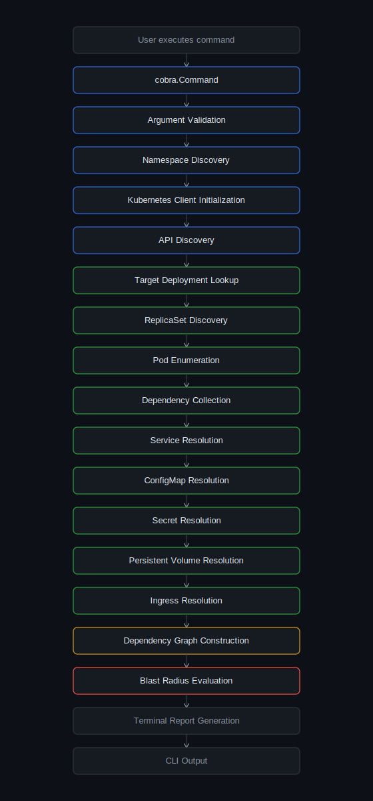
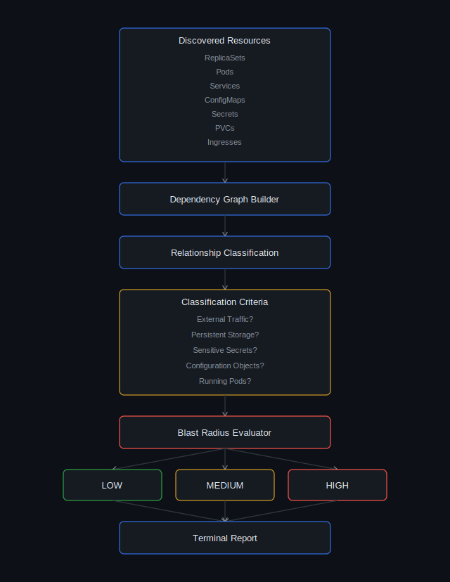

<div align="center">

# 🦅 Hawk Architecture

**A native `kubectl` plugin for pre-deletion dependency and blast-radius analysis**


</div>

---

Hawk is a dependency analysis engine implemented as a native `kubectl` plugin. It runs entirely on demand — no controllers, no CRDs, no cluster-side footprint — and gives operators a pre-deletion view of a workload's blast radius before they run `kubectl delete`.

```bash
$ kubectl hawk analyze deployment/checkout-service -n payments

Resolving deployment/checkout-service ...
Discovered 14 related resources across 4 kinds
Blast radius: HIGH — 2 Services, 1 Ingress, 3 Secrets exposed
```

## Table of Contents

- [Overview](#overview)
- [High-Level Architecture](#high-level-architecture)
- [Design Principles](#design-principles)
- [Execution Flow](#execution-flow)
- [System Components](#system-components)
  - [CLI Layer](#cli-layer)
  - [Analysis Orchestrator](#analysis-orchestrator)
  - [Dependency Discovery Pipeline](#dependency-discovery-pipeline)
  - [Dependency Graph Construction](#dependency-graph-construction)
  - [Blast Radius Evaluation](#blast-radius-evaluation)
- [Kubernetes API Interaction](#kubernetes-api-interaction)
- [Performance Considerations](#performance-considerations)
- [Error Handling](#error-handling)
- [Tech Stack](#tech-stack)

---

## Overview

Unlike long-running Kubernetes controllers or operators, Hawk executes entirely on demand. Every analysis request follows a deterministic pipeline: it communicates directly with the Kubernetes API server, discovers resource relationships, constructs an in-memory dependency graph, evaluates the workload's operational blast radius, and renders the results to the terminal.

The architecture intentionally avoids cluster-side components — controllers, agents, CRDs, admission webhooks. This keeps deployment simple while ensuring every analysis reflects the current cluster state.

## High-Level Architecture

<p align="center">
  
</p>

Hawk is organized into modular layers, each responsible for a single stage of the dependency analysis pipeline. Resource discovery, graph construction, and report generation are deliberately decoupled rather than tightly bound together — this simplifies maintenance and lets new resource collectors or analysis engines be added with minimal impact on existing functionality.

## Design Principles

| Principle | Description |
|---|---|
|  **Stateless, read-only execution** | Every Kubernetes interaction is a non-mutating, read-only API request. Hawk guarantees zero state alteration. |
|  **Zero cluster footprint** | No controllers, agents, webhooks, or CRDs. The plugin runs entirely client-side and terminates immediately after analysis. |
|  **Native API convergence** | Built on the official Go `client-go` SDK, ensuring full compatibility with upstream Kubernetes API semantics and versioning. |
|  **Deterministic lineage maps** | Dependency trees are derived from concrete metadata (`OwnerReferences`, labels, specs) — never speculative heuristics. |
|  **Decoupled core modules** | Collectors, graph builders, and formatters are isolated into single-responsibility layers to prevent runtime side effects. |

## Execution Flow


<p align="center">
  
</p>

## System Components

### CLI Layer

The CLI layer is the public interface to Hawk, implemented with [Cobra](https://github.com/spf13/cobra). It is responsible for:

- Command parsing and argument validation
- Namespace resolution
- Kubernetes context resolution and authenticated client initialization
- Dispatching analysis requests into the execution pipeline

### Analysis Orchestrator

The orchestrator coordinates the full lifecycle of a dependency analysis request. It determines the target workload, initializes resource collectors, manages traversal order, propagates execution context, and aggregates discovered resources before graph construction begins.

The orchestrator itself performs no resource-specific analysis — it delegates that to specialized collectors while owning execution ordering and failure propagation.

### Dependency Discovery Pipeline

Discovery begins by resolving the user-specified workload through the Kubernetes API.

1. Starting from the Deployment, Hawk recursively traverses `OwnerReferences` to discover its ReplicaSets and Pods.
2. Once the Pod layer is resolved, Pod specs are inspected to identify indirect dependencies — ConfigMaps, Secrets, and PersistentVolumeClaims referenced via mounted volumes or environment variables.
3. Network exposure is resolved independently: Services via label-selector evaluation, then Ingress resources via Service backends.

This staged traversal minimizes unnecessary API requests while ensuring every operationally significant dependency is captured before graph construction begins.

<p align="center">
  
</p>

### Dependency Graph Construction

Once discovery completes, Hawk transforms the collected Kubernetes objects into an in-memory **directed dependency graph**:

- Each Kubernetes object becomes a graph node.
- Ownership and dependency relationships become directed edges.
- Nodes are deduplicated before insertion, guaranteeing deterministic graph construction regardless of discovery order.

This graph is the canonical representation consumed by both blast radius evaluation and report generation.

### Blast Radius Evaluation

<p align="center">
  
</p>

The Blast Radius Engine evaluates the dependency graph to estimate the operational impact of modifying or deleting the target workload. Rather than assigning arbitrary risk scores, Hawk classifies impact by the presence of operationally significant dependencies:

| Signal | Impact |
|---|---|
| Externally exposed Service / Ingress | 🔴 High — user-facing traffic at risk |
| PersistentVolumeClaim | 🟠 Medium — stateful data at risk |
| ConfigMap / Secret shared across workloads | 🟡 Medium — blast radius extends beyond target |
| No external exposure, no shared state | 🟢 Low |

This lets operators see not just what's connected to a workload, but which of those connections warrant extra caution before a change ships to production.

## Kubernetes API Interaction

Hawk communicates directly with the Kubernetes API server through the official `client-go` library. Collectors operate against stable, upstream API groups only:

- `apps/v1`
- `core/v1`
- `networking.k8s.io/v1`

No custom resources or third-party APIs are required. All requests are authenticated, read-only, and scoped to the target namespace unless broader discovery is explicitly required — keeping Hawk compatible with any standard Kubernetes distribution and free of additional operational dependencies.

## Performance Considerations

- Discovery is **targeted**, starting from the requested workload rather than scanning the entire cluster — API requests scale with the size of the application, not the cluster.
- Traversal proceeds incrementally through ownership relationships.
- The dependency graph lives entirely in memory during execution and is discarded immediately after report generation, keeping Hawk lightweight with no persistent runtime state.

## Error Handling

Validation runs at every stage of the pipeline. Failures — invalid Kubernetes context, inaccessible API server, missing namespace, unsupported resource type, nonexistent workload — terminate the current analysis while preserving descriptive diagnostic output.

Errors originating from Kubernetes API calls are propagated without suppressing context, keeping troubleshooting straightforward for the operator.

## Tech Stack

| Layer | Technology |
|---|---|
| CLI framework | [Cobra](https://github.com/spf13/cobra) |
| Kubernetes client | [`client-go`](https://github.com/kubernetes/client-go) |
| Language | Go |
| Distribution | `kubectl` plugin (Krew-compatible) |