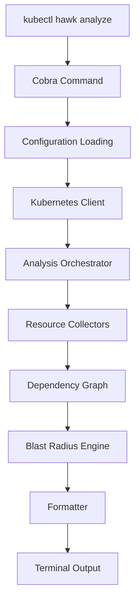

# Hawk Internals

This document describes the internal implementation of Hawk and the execution pipeline responsible for dependency analysis.

Where the [architecture documentation](architecture.md) explains the high-level design of the system, this document focuses on implementation details, package organization, and execution flow within the codebase.

The primary objective of Hawk is to transform a user-specified Kubernetes workload into a structured dependency graph by discovering ownership relationships, configuration references, storage dependencies, and network exposure through the Kubernetes API.

## Table of Contents

- [Project Layout](#project-layout)
- [Execution Flow](#execution-flow)
- [Kubernetes Client Initialization](#kubernetes-client-initialization)
- [Resource Collectors](#resource-collectors)
- [Dependency Graph](#dependency-graph)
- [Blast Radius Engine](#blast-radius-engine)
- [Output Formatter](#output-formatter)
- [Error Propagation](#error-propagation)
- [Extending Hawk](#extending-hawk)
- [Current Limitations](#current-limitations)

---

## Project Layout

The codebase is organized into independent packages, each responsible for a single stage of the dependency analysis pipeline.

```text
cmd/            Entry point for CLI commands.

internal/       Core implementation.
  analysis/     Analysis orchestration.
  collectors/   Kubernetes resource collectors.
  graph/        Dependency graph construction.
  blast/        Blast radius evaluation.
  formatter/    Terminal report generation.
  utils/        Shared helper functions.
```

Each package is designed to remain loosely coupled, allowing new collectors or analysis engines to be introduced without affecting unrelated components.

## Execution Flow

Every Hawk execution follows the same deterministic pipeline. Each stage receives immutable inputs from the previous stage and produces structured output for the next, minimizing coupling and simplifying debugging.



## Kubernetes Client Initialization

Hawk initializes a Kubernetes client using the official `client-go` library. Initialization performs the following operations, in order:

1. Resolve the active kubeconfig.
2. Load the current Kubernetes context.
3. Authenticate against the API server.
4. Create typed clients for supported API groups.
5. Verify cluster connectivity before analysis begins.

All communication is performed through authenticated, read-only requests.

## Resource Collectors

Resource collection is implemented through specialized collectors, each responsible for discovering Kubernetes objects of a single type. Analysis begins with the target Deployment and progressively expands the dependency tree.

| Collector | Responsibility |
|---|---|
| Deployment | Entry point |
| ReplicaSet | `OwnerReference` traversal |
| Pod | Workload discovery |
| ConfigMap | Configuration references |
| Secret | Secret references |
| PersistentVolumeClaim | Storage dependencies |
| Service | Network exposure |
| Ingress | External access |

Each collector performs discovery only — no collector performs graph construction or blast radius evaluation, preserving single-responsibility boundaries.

## Dependency Graph

After resource discovery completes, Hawk transforms the collected resources into an in-memory directed graph:

1. Create a node for every discovered Kubernetes object.
2. Create directed edges representing ownership or dependency relationships.
3. Eliminate duplicate nodes before insertion.

```text
Deployment
    │
    ▼
ReplicaSet
    │
    ▼
   Pod
 ├── ConfigMap
 ├── Secret
 └── PVC
    │
    ▼
 Service
    │
    ▼
 Ingress
```

The graph is the canonical representation consumed by all subsequent analysis stages.

## Blast Radius Engine

The Blast Radius Engine evaluates the dependency graph after construction has completed. Rather than evaluating individual resources independently, it analyzes the complete graph to determine the operational impact of modifying the target workload.

Current evaluation considers:

- Services
- Ingresses
- PersistentVolumeClaims
- ConfigMaps
- Secrets

The resulting classification is included in the final report presented to the user.

## Output Formatter

The formatter converts the analyzed dependency graph into a human-readable terminal report. Formatting is intentionally separated from analysis logic, allowing future output formats (JSON, YAML, Graphviz) to be implemented without modifying collectors or graph construction.

Current output includes:

- Dependency tree
- Resource summary
- Blast radius evaluation
- Execution statistics (where applicable)

## Error Propagation

Errors are propagated through the execution pipeline without suppression. Typical failure conditions include:

- Invalid kubeconfig
- Authentication failures
- API server connectivity issues
- Namespace not found
- Workload not found
- Unsupported resource types

Each execution terminates immediately after an unrecoverable error while preserving descriptive diagnostic information.

## Extending Hawk

The modular architecture allows new resource collectors and analysis engines to be added with minimal changes to existing components. To support a new Kubernetes resource:

1. Implement a dedicated collector.
2. Register the collector with the analysis pipeline.
3. Add graph construction logic.
4. Update blast radius evaluation if required.
5. Extend the formatter to display the new resource.

This design keeps new functionality isolated and minimizes regression risk.

## Current Limitations

The current implementation intentionally focuses on application-centric dependency discovery:

- Namespace-scoped analysis only
- No cluster-wide graph generation
- Terminal output only
- No persistent caching
- No visualization export formats
- Limited support for additional workload types beyond the current implementation

These are intentional design decisions, not oversights — they keep the execution pipeline lightweight and deterministic while leaving room for future enhancements.